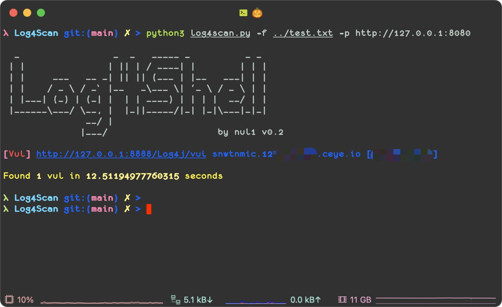
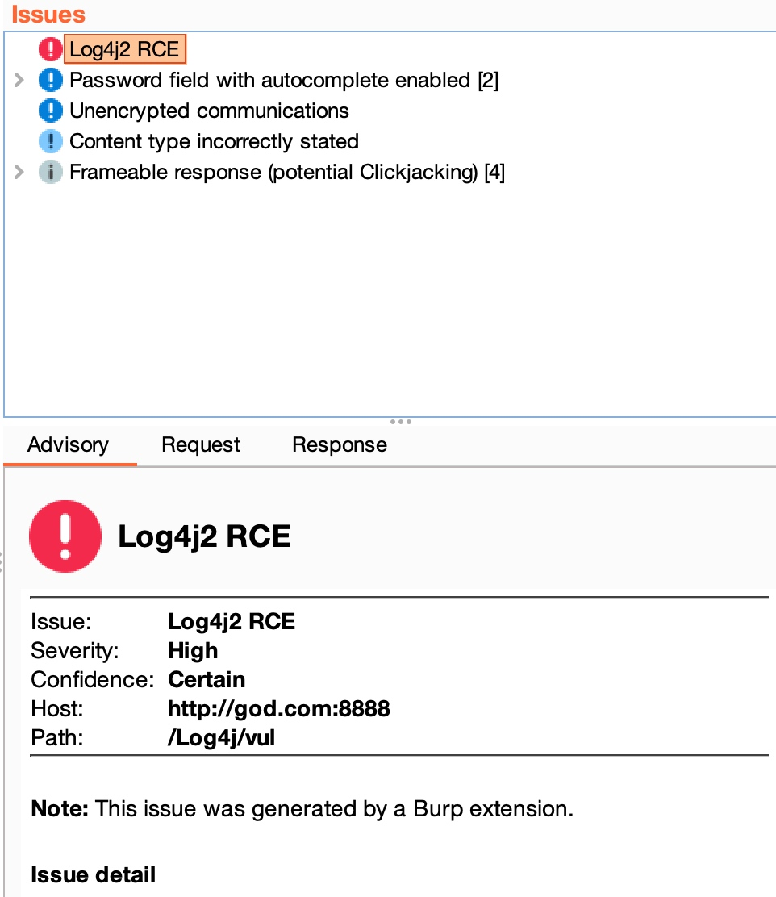

# 🐞 Log4Scan 
🔧 Log4Shell 简单的主动和被动扫描脚本

## Log4scan
针对header头和fuzz参数的主动批量扫描，针对资产大批量黑盒检测
> 先配置ceye信息
```
self.host = ""
self.token = ""
```



## PassiveLog4Scan
burp suite 被动扫描插件，对每个参数做一次请求
> 先配置ceye信息
```
self.host = ""
self.token = ""
```


